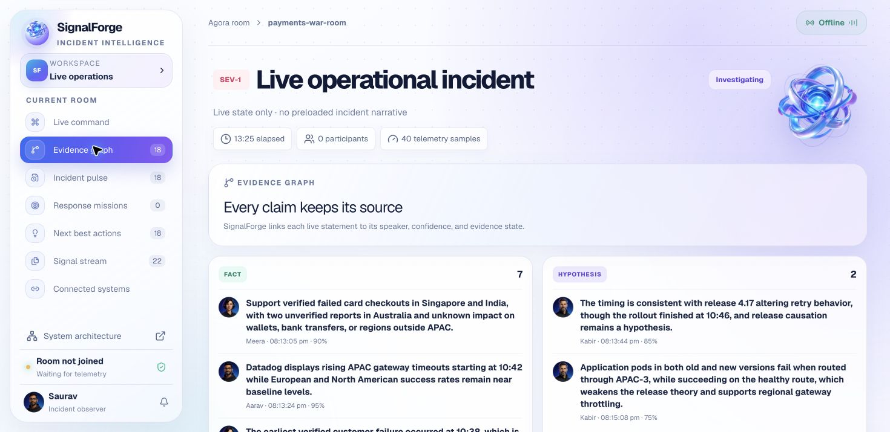
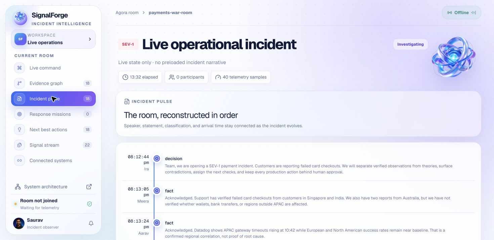
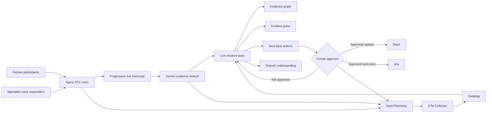

  
  <h1>SignalForge</h1>
  
<strong>Real-time voice intelligence for evidence-grounded incident command.</strong>

  

    SignalForge listens inside a live operational room, keeps the team aligned on what is known and unknown, coordinates specialist AI responders, and protects critical actions with explicit human approval.
  

  

    <a href="https://signalforge-architecture.netlify.app/"><strong>Explore the interactive system architecture →</strong></a>
  

---

## The problem

High-severity incident rooms are noisy. Engineers, support leaders, and business stakeholders arrive with partial evidence, different clocks, and competing theories. Important facts become buried in conversation, hypotheses harden into “truth,” ownership is unclear, and teams can confuse a mitigation being executed with recovery being proven.

SignalForge creates a continuously updated shared understanding without pretending to determine the root cause on its own.

## What SignalForge does

- Participates in a live Agora voice room with participant identity and role awareness.
- Streams speech into the interface as it is spoken instead of revealing completed text early.
- Uses Gemini to classify finalized statements as facts, hypotheses, conflicts, questions, decisions, or actions—with confidence and evidence gaps.
- Builds an evidence graph and chronological incident pulse from the same live conversation.
- Coordinates four specialist voice responders without overlapping speech.
- Detects contradictory claims, missing verification, ambiguous ownership, and unresolved risk.
- Ranks next-best checks by expected information gain.
- Converts accepted recommendations into accountable response missions.
- Publishes reviewed updates to Slack and creates owned Jira work only after human confirmation.
- Emits traces, metrics, and structured logs through OpenTelemetry to Datadog.
- Produces a final incident summary that preserves uncertainty and unresolved risks.

> SignalForge never announces an autonomous root cause. It organizes evidence, proposes safe checks, and keeps consequential operations human-controlled.

## Product views

### Evidence that stays attributable

Every claim retains its speaker, timestamp, category, confidence, and the next evidence needed to strengthen or falsify it.

### A timeline the whole room can trust

The incident pulse reconstructs the discussion in order while keeping facts, theories, conflicts, decisions, and actions visually distinct.

### Recommendations optimized for learning

SignalForge favors high-information, low-risk checks. Each recommendation explains its rationale, supporting evidence, missing evidence, confidence, and suggested owner.

### One control plane for the response stack

Agora, Gemini, Datadog, OpenTelemetry, Slack, and Jira are visible in a single operational surface. Secret values remain masked and external writes remain approval-gated.

## Architecture

### Runtime flow

1. **Listen** — Agora carries live audio, participant arrivals, speaker identity, and agent media.
2. **Transcribe** — Human and agent speech is revealed progressively; only finalized speech enters incident memory.
3. **Interpret** — Gemini separates observation from inference and returns a typed statement, confidence, normalized summary, evidence gaps, and a proposed next check.
4. **Reconcile** — SignalForge updates the evidence graph, shared understanding, timeline, conflict count, and open questions.
5. **Recommend** — Candidate checks are ranked by information gain and paired with an accountable role.
6. **Confirm** — Critical changes and external writes remain proposals until a human explicitly approves them.
7. **Verify** — OpenTelemetry and Datadog provide the operational signals needed to judge whether mitigation actually improved the system.
8. **Summarize** — The closing record distinguishes confirmed impact, leading hypotheses, decisions, actions, and unresolved risk.

## The specialist responder council

SignalForge uses bounded roles instead of one all-knowing assistant:

| Responder | Role | Operational boundary |
| --- | --- | --- |
| **Ira** | Incident facilitator | Maintains shared understanding, ownership, decisions, and human approval gates. |
| **Aarav** | SRE investigator | Tests infrastructure theories with telemetry and falsifiable, read-only checks. |
| **Meera** | Customer impact lead | Defines affected users and workflows while keeping stakeholder updates precise. |
| **Kabir** | Payments application responder | Connects release evidence to service behavior and proposes reversible mitigations. |

The response director enforces single-speaker turn-taking. Each responder acknowledges the previous contribution before advancing the investigation, so the room remains understandable and interruptible by the human observer.

## Evidence model

| State | Meaning | Example treatment |
| --- | --- | --- |
| **Fact** | Directly observed or verified | Retained with source and confidence. |
| **Hypothesis** | Plausible but unproven explanation | Linked to a falsifying check. |
| **Conflict** | Evidence weakens or contradicts a claim | Surfaced immediately; certainty is reduced. |
| **Question** | Information required to proceed safely | Kept open until evidence resolves it. |
| **Decision** | A reviewed choice or proposal | Records rationale and approval state. |
| **Action** | Accountable follow-up | Tracks owner, state, and verification needs. |

## Technology map

| Layer | Technology | Responsibility |
| --- | --- | --- |
| Experience | React 19, TypeScript, Vinext | Responsive incident workspace and live projections. |
| Real-time media | Agora RTC SDK | Voice room, participant events, remote audio, and encrypted media transport. |
| Voice responders | Agora Agents SDK | Specialist agent sessions and non-overlapping speech orchestration. |
| Intelligence | Gemini Flash / Gemini Live | Statement classification, confidence, evidence gaps, summaries, and next checks. |
| Observability | OpenTelemetry Collector | Receives, enriches, batches, and routes logs, metrics, and traces. |
| Operations data | Datadog | Live telemetry, log search, recovery signals, and incident observability. |
| Collaboration | Slack | Human-reviewed incident status, conversation, and conclusion publishing. |
| Work tracking | Jira | Human-approved, owned follow-up tasks. |
| Runtime | Cloudflare-compatible Vinext server | API routes, credential boundary, agent orchestration, and integration adapters. |

## Human-control and security model

- Provider credentials are server-side only; no secret is embedded in the browser bundle.
- Local credential files, collector secrets, build output, and generated runtime state are excluded from source control.
- The integration vault masks values and never returns stored secrets to the browser.
- Persistent deployments are designed to use encrypted platform secrets rather than checked-in configuration.
- Slack and Jira writes require a reviewed payload plus an explicit confirmation control.
- Voice agents may investigate, summarize, and recommend; they cannot authorize production changes.
- Recovery is a measured outcome, not an assumption made after execution.

## Why it is agentic

SignalForge is not a transcript wrapper or a chain of unrelated API calls. Its agents operate against a shared incident state, have different responsibilities and guardrails, challenge one another with evidence, select the next investigation by expected information value, and maintain unfinished work across the conversation. The system’s intelligence is expressed through coordination and disciplined uncertainty—not fabricated authority.

## Hackathon evaluation alignment

| Criterion | SignalForge response |
| --- | --- |
| **Innovation** | Evidence-linked multi-agent deliberation, contradiction handling, information-gain recommendations, and explicit execution-versus-recovery tracking. |
| **Problem relevance** | Directly addresses confusion, unsupported certainty, missing owners, fragmented timelines, and unsafe actions in live incident rooms. |
| **Technical feasibility** | Built on production-oriented RTC, LLM, observability, and collaboration APIs with bounded agent roles and deterministic approval controls. |
| **Expected impact** | Faster shared understanding, fewer duplicated investigations, clearer accountability, safer mitigation, and higher-quality post-incident records. |
| **Agora utilization** | Agora is the real-time participation layer: live audio, room presence, speaker identity, remote playback, and cloud voice-agent sessions. |

## Current scope and planned evolution

The current system implements the live voice room, progressive transcription, specialist response sequence, evidence intelligence, recommendations, missions, telemetry views, configuration vault, and human-confirmed Slack/Jira actions.

Planned evolution includes durable incident and conversation history, organization-level access controls, replayable decision audits, additional monitoring adapters, and recovery-policy templates. PagerDuty is optional rather than required; SignalForge can coordinate the incident directly through Agora, Slack, Jira, and the connected observability stack.

## Team

- **Saurav Mukherjee — Team Lead:** system architecture, real-time/agent orchestration, integrations, and end-to-end engineering.
- **Diya Vijay — Product & Incident Experience:** incident workflow design, user experience, evaluation narrative, and stakeholder communication.

## Repository policy

This is an internal hackathon project published for technical evaluation. Operational credentials, private environment files, and internal deployment runbooks are intentionally excluded. This README documents the system and architecture but does not include local execution instructions.
