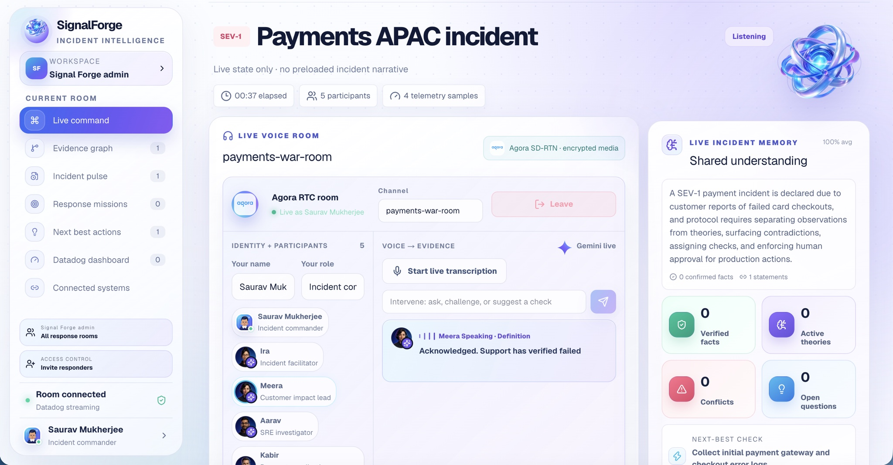
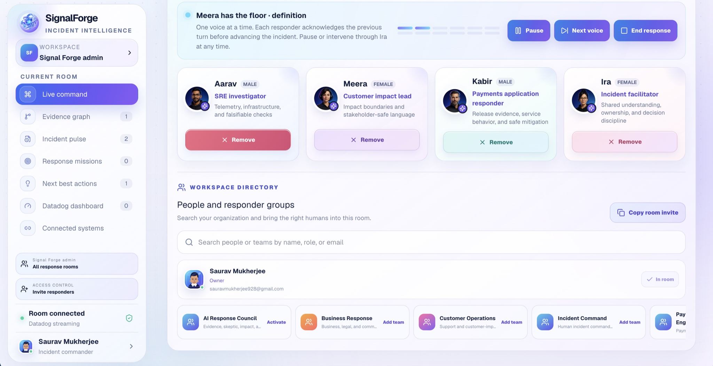
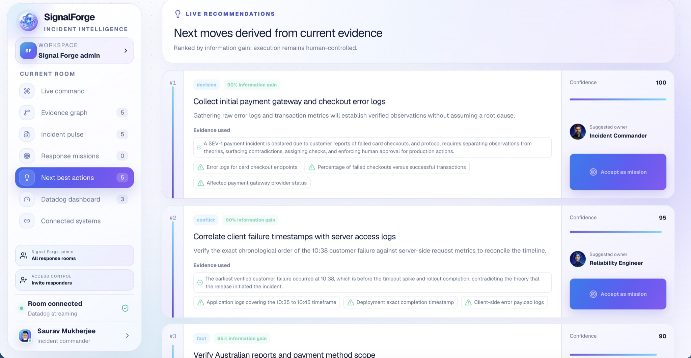
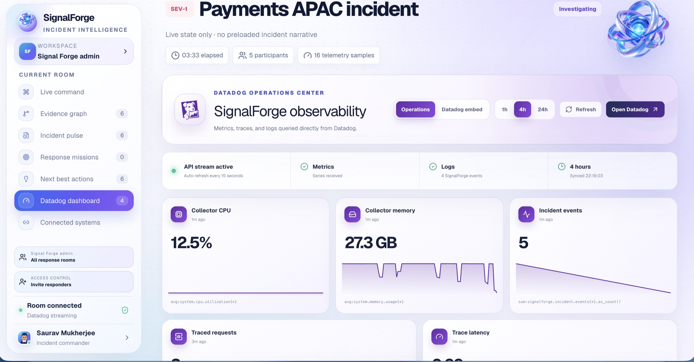
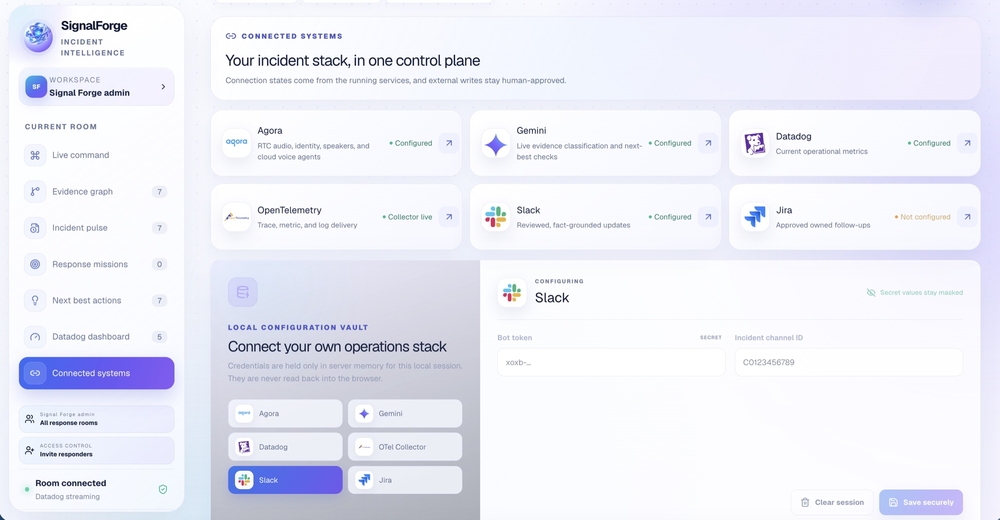
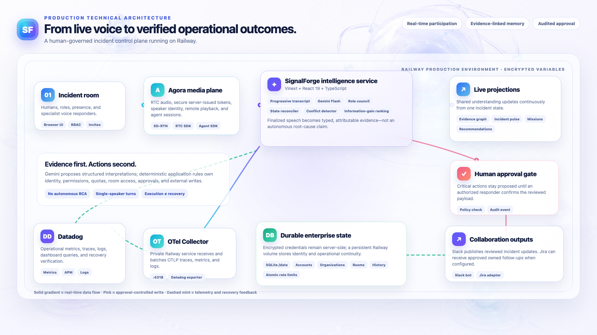

  
  <h1>SignalForge</h1>
  
<strong>Real-time voice intelligence for evidence-grounded incident command.</strong>

  

    SignalForge joins a live incident room, turns discussion into attributable evidence,
    coordinates specialist responders, and keeps consequential actions under human control.
  

  

    <a href="https://signalforge-ai-incident-command.up.railway.app/"><strong>Open SignalForge →</strong></a>
    &nbsp;·&nbsp;
    <a href="https://signalforge-architecture.netlify.app/"><strong>Explore the interactive architecture →</strong></a>
  

---

## Why SignalForge exists

High-severity incident rooms are noisy. Engineers, support leaders, and business stakeholders arrive with partial evidence, different clocks, and competing theories. Important observations disappear into conversation, hypotheses harden into “truth,” ownership becomes ambiguous, and a mitigation can be mistaken for recovery.

SignalForge maintains a shared operational picture without pretending to independently determine the root cause. It makes uncertainty visible, gives the next investigation an owner, and preserves the human incident commander’s authority.

## What the system does

- Participates in a live Agora RTC room with identity, roles, presence, and secure server-issued access tokens.
- Reveals human and agent speech progressively, then commits only finalized turns to incident memory.
- Uses Gemini to classify speech as a fact, hypothesis, conflict, question, decision, or action—with confidence and missing evidence.
- Builds a continuously updated evidence graph, incident pulse, shared understanding, and unresolved-risk register.
- Coordinates four bounded specialist responders with strict single-speaker turn-taking.
- Detects contradictions, unsupported certainty, missing owners, incomplete verification, and open questions.
- Ranks next-best checks by information gain and converts accepted recommendations into owned response missions.
- Publishes reviewed updates through a Slack bot and supports approval-gated Jira follow-ups when configured.
- Emits traces, metrics, and structured logs through a dedicated OpenTelemetry Collector into Datadog.
- Provides organization accounts, role-based room access, searchable people and teams, secure invites, room history, and persisted quotas.

> SignalForge never announces an autonomous root cause. It organizes evidence, proposes safe checks, and keeps external writes and critical actions human-approved.

## Product experience

### A live room that remains understandable

Agora carries the conversation while the response director prevents agents from speaking over one another. Human observers can pause, advance, or intervene at any point, and the transcript becomes visible as the speaker talks.

### Recommendations that explain their reasoning

Every proposed next move shows its evidence, missing information, confidence, information gain, and suggested owner. Accepting a recommendation creates an accountable mission; it does not silently execute a production change.

### Datadog inside the operational workspace

The Datadog operations center queries current metrics, traces, and logs, refreshes automatically, and links recovery claims back to observable signals. Teams can also open the securely embedded Datadog view when they need the full monitoring surface.

### One control plane for the response stack

Agora, Gemini, Datadog, OpenTelemetry, Slack, and Jira are visible from one integration surface. Provider credentials stay server-side and are masked in the browser.

## Technical architecture

The production runtime is split into two Railway services:

1. **SignalForge web and API service** — serves the React workspace, authenticates users, enforces room permissions and quotas, issues Agora tokens, orchestrates Gemini analysis, and owns approval-gated integrations.
2. **OpenTelemetry Collector** — receives OTLP traffic over Railway’s private network, batches and enriches telemetry, exposes health status, and exports traces, metrics, and logs to Datadog.

A persistent Railway volume stores SQLite state under `/data`. Platform variables hold provider credentials outside the repository and browser bundle.

### Runtime flow

1. **Join** — an authenticated participant enters an authorized room; the server issues a short-lived Agora RTC token bound to the room and numeric user ID.
2. **Listen** — Agora transports human and specialist-agent audio, participant events, identity, and remote playback.
3. **Transcribe** — interim text is displayed progressively; only finalized speech advances the incident state.
4. **Interpret** — Gemini returns a typed statement, confidence, normalized claim, missing evidence, and a safe next check.
5. **Reconcile** — SignalForge updates the evidence graph, shared understanding, pulse, conflicts, questions, recommendations, and missions from the same source of truth.
6. **Approve** — deterministic policy and authorization checks keep external writes and consequential actions proposed until a human confirms them.
7. **Observe** — application and incident events travel over OTLP to the collector and Datadog.
8. **Verify** — recovery is accepted only when current telemetry supports it; execution and outcome remain separate states.

## Specialist responder council

SignalForge uses bounded roles instead of one all-knowing assistant:

| Responder | Role | Operational boundary |
| --- | --- | --- |
| **Ira** | Incident facilitator | Maintains shared understanding, ownership, decisions, unresolved risk, and human approval gates. |
| **Aarav** | SRE investigator | Tests infrastructure theories with telemetry and falsifiable, read-only checks. |
| **Meera** | Customer impact lead | Defines affected customers and workflows while keeping stakeholder language precise. |
| **Kabir** | Payments application responder | Connects release evidence to service behavior and proposes reversible mitigations. |

The response director enforces one voice at a time. Each responder acknowledges the previous contribution before advancing the investigation, keeping the room understandable and interruptible.

## Evidence model

| State | Meaning | System behavior |
| --- | --- | --- |
| **Fact** | Directly observed or independently verified | Retained with source, time, and confidence. |
| **Hypothesis** | A plausible but unproven explanation | Linked to evidence that could support or falsify it. |
| **Conflict** | Evidence weakens or contradicts a claim | Surfaced immediately and reduces unsupported certainty. |
| **Question** | Information required to proceed safely | Remains open until evidence resolves it. |
| **Decision** | A reviewed operational choice or proposal | Records rationale, actor, and approval state. |
| **Action** | An accountable follow-up | Tracks owner, status, due context, and verification need. |

## Technology map

| Layer | Technology | Responsibility |
| --- | --- | --- |
| Experience | React 19, TypeScript, Vinext | Responsive enterprise workspace and live incident projections. |
| Real-time media | Agora RTC SDK | Voice room, presence, participant identity, encrypted media transport, and remote audio. |
| Voice responders | Agora Agents SDK | Specialist sessions and ordered speech orchestration. |
| Intelligence | Gemini Flash / Gemini Live | Evidence classification, confidence, contradictions, summaries, and next checks. |
| Identity and state | SQLite on a Railway volume | Accounts, organizations, memberships, rooms, invites, agents, sessions, and daily usage. |
| Observability | OpenTelemetry Collector | Receives, enriches, batches, and exports logs, metrics, and traces. |
| Operations data | Datadog | Live dashboard queries, APM, logs, incident signals, and recovery verification. |
| Collaboration | Slack | Human-reviewed incident updates and final summaries. |
| Work tracking | Jira adapter | Optional human-approved, owned follow-up tasks. |
| Runtime | Railway + Docker | Persistent web/API service, private collector service, encrypted variables, and health checks. |

## Enterprise controls

- Email/password accounts with server-side sessions and secure, HTTP-only cookies.
- Organization membership, owner/member roles, room-level authorization, and invite-based onboarding.
- Searchable workspace directory for people, responder groups, and AI specialist teams.
- Room creation and history with a persistent operational database.
- Atomic daily quotas for Gemini analysis, voice turns, Agora tokens, room creation, invitations, and critical actions.
- Short-lived, server-generated Agora tokens; the App Certificate never reaches the browser.
- Provider credentials stored only in encrypted deployment variables or the local server vault.
- Human confirmation before Slack, Jira, or other consequential writes.
- Audit-friendly telemetry for analysis, decisions, approvals, and integration health.

## Why it is agentic

SignalForge is not a transcript wrapper or a sequence of unrelated API calls. Its agents operate against shared incident state, hold different responsibilities and guardrails, challenge one another with evidence, select investigations by expected information value, and keep unfinished work alive across the conversation. Intelligence appears as disciplined coordination—not fabricated authority.

## Hackathon evaluation alignment

| Criterion | SignalForge response |
| --- | --- |
| **Innovation** | Evidence-linked multi-agent deliberation, contradiction handling, information-gain recommendations, and explicit execution-versus-recovery tracking. |
| **Problem relevance** | Directly addresses unsupported certainty, fragmented timelines, missing owners, duplicated work, and unsafe action during live incidents. |
| **Technical feasibility** | A deployed RTC, LLM, identity, persistence, observability, and collaboration stack with bounded roles and deterministic controls. |
| **Expected impact** | Faster shared understanding, clearer accountability, safer mitigation, and higher-quality post-incident records. |
| **Agora utilization** | Agora is the real-time participation plane for live audio, room presence, identity, remote playback, and voice-agent sessions. |

## Team

- **Saurav Mukherjee — Team Lead:** system architecture, real-time and agent orchestration, integrations, deployment, and end-to-end engineering.
- **Diya Vijay — Product & Incident Experience:** incident workflow design, product experience, evaluation narrative, and stakeholder communication.

## Repository policy

This is an internal hackathon project published for technical evaluation. Operational credentials, private environment files, and internal deployment runbooks are intentionally excluded. The repository documents the system and architecture but does not provide local execution instructions.
